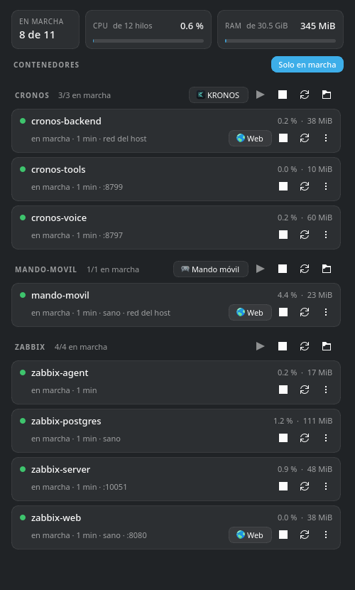

# ZenDock

Los contenedores Docker del portátil, con la misma pinta que
[ZenMonitor](https://github.com/PandaAkiraNakai/zenmonitor): estado, salud y consumo de
cada contenedor, agrupados por proyecto de compose, y los botones de siempre para
**encenderlos, apagarlos, reiniciarlos, abrir su web o lanzar la app que los acompaña**.
Vive en la bandeja del sistema y pesa lo que pesa un script de Python con PyQt6.



## Qué muestra

| Zona | Datos |
|---|---|
| **Resumen** | Contenedores en marcha, CPU y RAM que suman entre todos |
| **Proyecto** | Nombre, cuántos están en marcha, apps de escritorio asociadas y acciones de conjunto |
| **Contenedor** | Punto de estado, tiempo en marcha o desde que se paró, salud, puertos, CPU y RAM |

El punto de color resume el estado:

| Color | Significa |
|---|---|
| Verde | En marcha (y sano, si tiene healthcheck) |
| Ámbar | Arrancando, no sano, en pausa o con una acción en curso |
| Rojo | Reiniciándose en bucle, muerto, sin memoria o parado con un código de error |
| Gris | Parado normalmente (código 0, o 137/143 de un `docker stop`) |

El tooltip de cada tarjeta tiene el resto: imagen, ID, servicio de compose, puertos con
su IP, IPs en cada red y política de reinicio con su contador.

## Qué hace

- **Encender, apagar y reiniciar** cada contenedor, o el **proyecto entero** desde su
  cabecera. Las acciones de proyecto usan `docker compose start/stop/restart` con los
  ficheros del propio proyecto, así que respetan `depends_on`. Si esos ficheros ya no
  existen, se hace contenedor a contenedor por la API.
- **Web**: botón que abre en el navegador la web que sirve el contenedor. Si tiene
  varias, despliega un menú.
- **App**: botón que lanza la aplicación de escritorio asociada al proyecto (por
  ejemplo KRONOS para `cronos`).
- **Menú ⋯**: ver logs en vivo (`docker logs -f` en Konsole), abrir una shell dentro,
  pausar/reanudar, copiar la IP o el nombre y abrir la carpeta del proyecto.
- **Avisos**: una notificación si un contenedor se cae con un código de error, se queda
  sin memoria o su healthcheck empieza a fallar. Un `docker stop` o un apagado desde la
  propia app no avisan. Se desactiva desde el menú de la bandeja.
- **Solo en marcha**: esconde los contenedores y proyectos parados.

## Cómo encuentra las webs

Nada que configurar en el caso normal:

1. A cada **puerto TCP publicado** se le hace un `GET /`. Cuenta como web si responde
   HTML o una redirección. Una API que contesta JSON no cuenta, y a los puertos de
   protocolos que no son HTTP (SSH, PostgreSQL, MySQL, Redis, Zabbix…) ni se les
   pregunta.
2. Un contenedor con **red del host** no publica puertos, así que se prueban los que
   declara su imagen (`EXPOSE`), **salvo los que ya publica otro contenedor**. Hace falta
   la excepción: `cronos-backend` declara el 8080 pero escucha en el 8765, y el 8080 del
   host es el de Zabbix.
3. Si el puerto no contesta todavía (Apache tarda un segundo en abrirlo al arrancar), se
   vuelve a probar cada 3 s durante los dos primeros minutos y luego cada minuto. Un
   "esto no es una web" sí es definitivo hasta que el contenedor se reinicie.

Lo que no se puede adivinar se fija a mano. Una web explícita sustituye a las
detectadas:

- Con una **etiqueta** en el `docker-compose.yml`:

  ```yaml
  labels:
    zendock.web: "Panel=http://localhost:8765, API=http://localhost:8765/docs"
    zendock.app: "cronos.desktop"
  ```

- O en **`~/.config/zendock/enlaces.json`**, sin tocar el proyecto. La clave es el nombre
  del contenedor para `web` y el del proyecto (o del contenedor suelto) para `app`:

  ```json
  {
    "cronos-backend": {"web": ["Cronos=http://127.0.0.1:8765"]},
    "mando-movil": {"web": ["QR para el móvil=http://localhost:8777/conectar"]}
  }
  ```

  El fichero se relee solo al guardarlo. Si tiene un error de sintaxis, la ventana lo
  dice abajo.

## Cómo encuentra las apps

Recorre los `.desktop` de `~/.local/share/applications`, `/usr/local/share/applications`
y `/usr/share/applications` y asocia una app a un proyecto si:

- el fichero se llama como el proyecto (`cronos.desktop` ↔ proyecto `cronos`), o
- su ejecutable, siguiendo enlaces simbólicos, vive dentro de la carpeta del proyecto
  (`~/.local/bin/mando-movil` → `~/docker/mando-movil/mando-movil`), o
- es un script de tu `$HOME` que menciona la carpeta del proyecto.

Con `zendock.app` o la clave `app` de `enlaces.json` se elige a mano. Las apps se lanzan
con `gtk-launch`, igual que desde el menú.

## Requisitos

- Python 3 y PyQt6 (`pacman -S python-pyqt6` en Arch; `python3-pyqt6` en Debian/Ubuntu).
- Acceso al socket de Docker: estar en el grupo `docker`
  (`sudo usermod -aG docker "$USER"` y volver a iniciar sesión). Respeta `DOCKER_HOST`
  si apunta a un socket `unix://`.
- El plugin `docker compose` para las acciones de proyecto.
- Konsole para logs y shell (si no está, prueba con `x-terminal-emulator` o `xterm`).

## Instalación

```sh
git clone https://github.com/PandaAkiraNakai/zendock.git
cd zendock
./install.sh
```

Todo va a parar a `~/.local`, sin root: el script, un lanzador, la entrada del menú, el
icono (dibujado desde el vector del propio código) y una regla de ventana de KWin igual
que la de ZenMonitor, para que volver a abrirlo traiga la ventana al frente. Opciones:

```sh
./install.sh --autostart   # arranca con la sesión, en segundo plano (solo bandeja)
```

Para quitarlo: `./uninstall.sh` (no borra tu `enlaces.json`).

## Uso

- Clic en el icono de la bandeja: muestra u oculta la ventana.
- Clic derecho: cada proyecto con encender/apagar/reiniciar todo, sus apps y sus webs.
- El icono se pone azul si hay algo en marcha, ámbar si algo va mal o hay una acción en
  curso, y gris si no hay nada encendido. El tooltip lista lo que va mal.
- Cerrar la ventana la esconde en la bandeja; no cierra la aplicación.
- `zendock --tray` arranca sin ventana. Es de **instancia única**, como ZenMonitor.

## Cómo lee los datos

No lanza un `docker` por cada lectura: habla directamente con la API HTTP del Engine por
`/var/run/docker.sock`, con la biblioteca estándar de Python.

| Dato | Fuente |
|---|---|
| Lista y estado | `GET /containers/json?all=1` + `GET /containers/{id}/json` |
| CPU | `cpu_stats` de `GET /containers/{id}/stats?one-shot=true`, dos lecturas seguidas, como `docker stats` (100 % = un núcleo) |
| RAM | `memory_stats.usage` menos `inactive_file`, como `docker stats` |
| Cambios al instante y avisos | Flujo `GET /events` filtrado a contenedores |
| Encender, apagar, reiniciar, pausar | `POST /containers/{id}/start\|stop\|restart\|pause\|unpause` |
| Acciones de proyecto | `docker compose -p … --project-directory … -f … start\|stop\|restart` |

En este portátil, listar e inspeccionar los once contenedores tarda unos 30 ms y las
estadísticas unos 6 ms por contenedor. Sondea cada 2 s por la CPU y la RAM, pero
cualquier cambio de estado llega antes por el flujo de eventos. Los eventos `exec_*` que
generan los healthcheck se ignoran para no despertar el sondeo en balde.

## Licencia

MIT. Ver [LICENSE](LICENSE).
